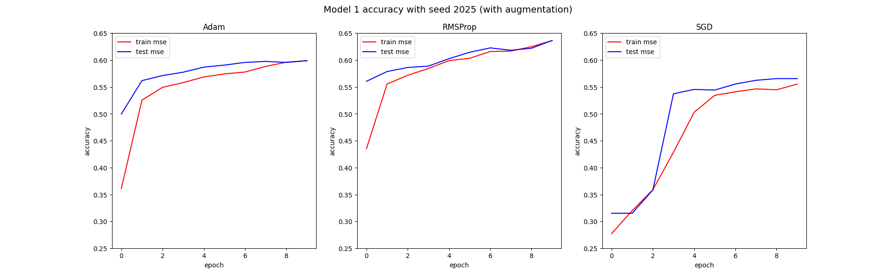
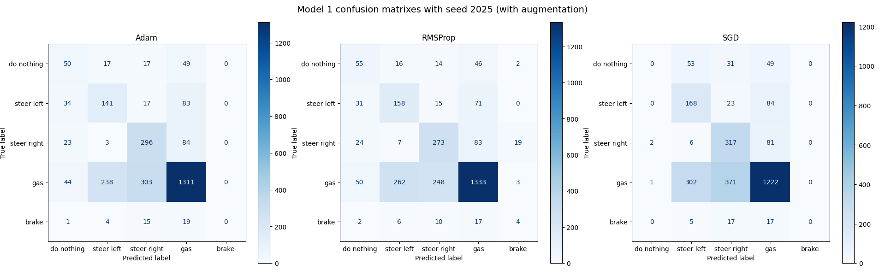
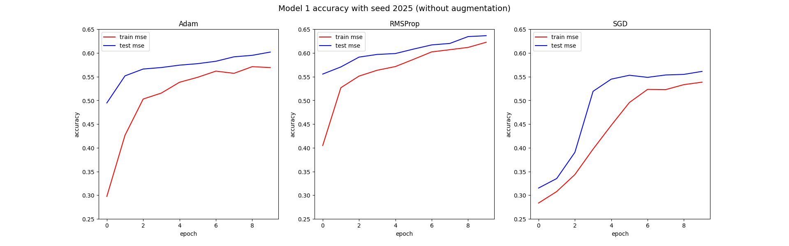
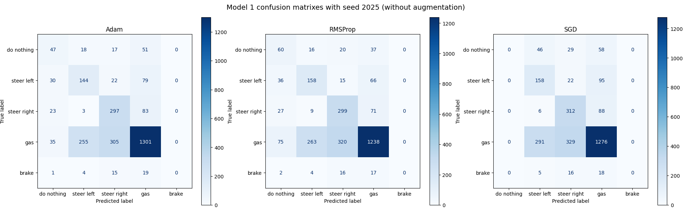

## Abstract

This is the report for the **second homework** of the Machine Learning course directed by Luca Iocchi for the Academic Year 24/25 for the Master's Degree in **Artificial Intellingence and Robotics** at Sapienza University of Rome.

In this homework, the goal was to learn a model that would learn how to drive a **2D top-view** car in a road with sharp left and right turns taken from gymnasium's [car racing](https://gymnasium.farama.org/environments/box2d/car_racing/) environment. 

More specifically, it is an **image classification** problem whose objective was to learn the following function 
$$
f:X = \{\underbrace{(96\times96\times3)}_{\text{colored images}}\} \to Y = \{0, 1, 2, 3, 4\}
$$

The (supervised) dataset for the problem is composed of colored screenshots each of size $(96 \times 96)$ pixels and has been provided by the **professor itself**, already split between training and test samples as shown in the following table

| Class label     |  Training samples    | Test samples  |
|  :---:        | :---:           | :---:   |
| do nothing | 1000 | 133 |
| steer left | 1500 | 275 |  
| steer right | 1500 | 406 |  
| gas | 2000 | 1896 |
| brake | 369 | 39 | 
| **TOTAL** | 6369 (69.9%) | 2749 (30.1%)

There were no attempts at trying to balance the dataset due to the **low amount** of samples for each class, especially `brake`. Of the above training samples $\frac{1}{5}$ where used for validation, and multiple **random states** of these splits have been tested for variability. 

Moreover, it is important to state that the dataset is somewhat **noisy** due to the presence of misclassified images, which is a recurring trait in real world image classification. Anyhow, it is a crucial factor to consider when evaluating the models' **accuracy**.

Two main approaches based on **Convolutional Neural Networks - CNNs** have been trained to try and learn the the problem, both equipped with **Sparse Categorical Cross-Entropy - SCCE** loss function, one of the best to consider when we have classification problems with **integer encoded** labels as above
$$
SCCE(x_i) = -\frac{1}{N} \sum_{i=1}^N \log \hat{P}(y_i)
$$

Additionally, the output layer will always have the **softmax** function, which behaves very well for multiclass classification problems
$$
\sigma(\mathbf{x}) = \frac{e^{x_i}}{\sum_{j=1}^K e^{x_j}} 
$$ 

The results that will be shown are **not guaranteed** to be the best achievable ones, as the homework's main objective was to enchance the student's knowledge about image classification and CNNs.

**Note**: Generative AI has been utilized in this project solely as inspiration for the code. The project in its entirety has been developed **individually** without any other external collaborators, including this report.

The **hardware** utilized to train the models is Nvidia RTX 3070 GPU (8GB VRAM) with driver version 560.35.03 and CUDA version 12.6 on Ubuntu 24.04.01 LTS x86_64 and 16GB of RAM.

## Preprocessing and data augmentation
Preprocessing is performed in machine learning to transform data in a **more suitable format** for model training, it has a relevant role in improving result quality and model efficiency: in this case, it has been applied to both proposed models simply by **normalizing** the data contained in each pixel between **0 and 1 included**.

Data augmentation is an important approach towards improving model generalization, thus **reducing overfitting**. In our problem the decision was to apply the following augmentation on all samples (values are compared to the original)

| Augmentation |  Minimum  | Maximum |
|  ---          | :---:           | :---:   |
| random gamma | 90% | 110% |
| random constrast | 90% | 110% |  
| random quality | 75% | 95% | 

  
**Not all** kinds of data augmentation make sense depending on the specific problem: for this case in fact **flipping** images left-to-right would confuse the model as it would misclassify left with right and viceversa more often. In practice, that would translate to a significantly worse model accuracy.

Preprocessing and augmenting all the data takes around **14.5 seconds**.

\newpage 

## First proposed model 
The first model that was proposed is composed of three convolutional layers with exponentially increasing units and two dense layers, which in its best form, after some testing, seems to be the following

| Layer | Units | Activation | Padding | Kernel size | Out Shape  | Parameters |
|  ---   | :---: | :---: |     :---:  | :---: | :---:           | :---:   |
| Conv2D | 32 | ReLU | valid | (2, 2) | (95, 95, 32) | 416 |
| MaxPooling2D | - | - | valid |  (2, 2) | (47, 47, 32) |  -
| Conv2D | 64 | ReLU | valid | (2, 2) | (46, 46, 64) | 8,256 
| MaxPooling2D | - | - | valid | (2, 2) | (23, 23, 64) | -
| Conv2D | 128 | ReLU | valid | (2, 2) | (22, 22, 128) | 32,896 
| MaxPooling2D | - | - | valid | (2, 2) | (11, 11, 128) | -
| Flatten | - | - | - | - | 15488 | - 
| Dense | 256 | ReLU | - | - | 256 | 3,965,184
| Dropout 0.5 | - | - | - | - | 256 | -
| Dense | 64 | ReLU | - | - | 64 | 16,448
| Output | 5 | softmax | - | - | 5 | 325 

The total number of trainable parameters is **4,023,525**.

Despite the hardware capabilities, performing the same automatic hyperparameter searching that was done in the first homework would take a **significant amount** of time to extract meaningful hyperparameter information, as there are many possible configurations to try. 

Instead, reasoning will be made of the above model considering it as **baseline**. This decision makes sense for practical problems too, considering that they get much more difficult that this.

\newpage

### Choosing the optimizer
The tested optimizers with optimally searched hyperparameters are as follows 

| Optimizer |  Learning rate | Extra parameters | Training time |  Batch size |
|  ---          | :---   | :--- | :---: | :---: |
| Adam | $\eta = 0.001$ | $\beta_1 = 0.6, \beta_2 = 0.8$ | 144.37s | 64 | 
| RMSProp | $\eta = 0.0001$ | $\mu = \rho = 0.9$ | 112.56s | 64 | 
| SGD | $\eta = 0.001$ | $\mu = 0.9$ | 106.25s | 64 |

Training the first model with the above for just **10 epochs** reveals the following result

In terms of **validation set accuracy**, RMSProp seems to be the most performant with 63.65, with Adam slightly behind at 59.89 and SGD in last place with just 56.56. It is also possible to see the respective **confusion matrixes** below

The above numbers **do not** tell the full story, in fact by utilizing the model on the simulation:
- RMSProp makes the car lock in place 
- Adam manages to stay on the road the longest of the three
- SGD behaves more or less like Adam, but in a more unstable way 

If we **didn't use** augmentation and also kept the same hyperparameter values, the result would be the following 

With the following confusion matrixes

Clearly showing that

Despite all of this, 

\newpage

## Second proposed model
The second model instead is as follows 

| Layer | Units | Activation | Padding | Kernel size | Out Shape  | Parameters |
|  ---   | :---: | :---: |     :---:  | :---: | :---:           | :---:   |
| Conv2D | 32 | ReLU | valid | (2, 2) | (95, 95, 32) | 896 |
| MaxPooling2D | - | - | valid |  (2, 2) | (47, 47, 32) |  -
| Conv2D | 64 | ReLU | valid | (2, 2) | (46, 46, 64) | 18,496 
| MaxPooling2D | - | - | valid | (2, 2) | (23, 23, 64) | -
| Conv2D | 128 | ReLU | valid | (2, 2) | (22, 22, 128) | 73,856 
| MaxPooling2D | - | - | valid | (2, 2) | (11, 11, 128) | -
| Conv2D | 256 | ReLU | valid | (2, 2) | (20, 20, 128) | 73,856 
| MaxPooling2D | - | - | valid | (2, 2) | (10, 10, 128) | -
| Flatten | - | - | - | - | 12800 | - 
| Dense | 512 | ReLU | - | - | 1024 | 13,108,224
| Dropout 0.8 | - | - | - | - | 1024 | - 
| Output | 5 | softmax | - | - | 5 | 5125 

## Conclusions 