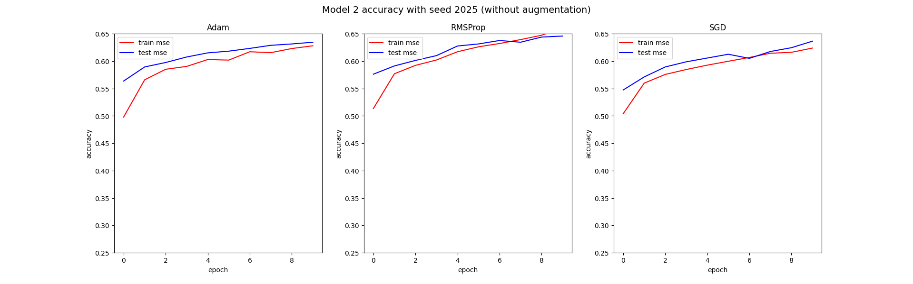

## Abstract

This is the report for the **second homework** of the Machine Learning course directed by Luca Iocchi for the Academic Year 24/25 for the Master's Degree in **Artificial Intelligence and Robotics** at Sapienza University of Rome.

In this homework, the goal was to devise a model that would learn how to drive a car on a track in a **2D top-view**, more specifically taken from gymnasium's [car racing](https://gymnasium.farama.org/environments/box2d/car_racing/) environment. All models and their variations have been tested with the same seed, thus on the same exact race track, meaning that results **may vary** for different seeds.

More specifically it is an **image classification** problem whose objective was to learn the following 
$$
f:X = \{\underbrace{(96\times96\times3)}_{\text{colored images}}\} \to Y = \{0, 1, 2, 3, 4\}
$$

The (supervised) dataset for the problem is composed of colored screenshots each of size $(96 \times 96)$ pixels and has been provided by the **professor itself**, already split between training and test set as shown in the following table

| Class label     |  Training samples    | Test samples  |
|  :---:        | :---:           | :---:   |
| _do nothing_ | 1000 | 133 |
| _steer left_ | 1500 | 275 |  
| _steer right_ | 1500 | 406 |  
| _gas_ | 2000 | 1896 |
| _brake_ | 369 | 39 | 
| **TOTAL** | 6369 (69.9%) | 2749 (30.1%)

There were no attempts at trying to balance the dataset due to the **low amount** of samples for each class, especially _brake_. Of the above training samples, $\frac{1}{5}$ where used for validation and the remaining $\frac{4}{5}$ for actual training. Multiple **random states** of these splits have been tested for variability. 

Moreover, it is important to state that the dataset is somewhat **noisy** due to the presence of misclassified images, which is a recurring trait in real world image classification problems. Anyhow, it is a crucial factor to consider when evaluating the models' **accuracy**.

Two main approaches based on **Convolutional Neural Networks - CNNs** have been trained to try and learn the the problem:

- **Model 1** prioritizing feature elaboration through manual hyperparameter searching
- **Model 2** more focused on feature extraction through automatic hyperparameter searching 
  
Both abovementioned models are equipped with **Sparse Categorical Cross-Entropy - SCCE** loss function, one of the best to consider when we have classification problems with **integer encoded** labels as we in fact have
$$
\text{SCCE}(x_i) = -\frac{1}{N} \sum_{i=1}^N \log \hat{P}(y_i)
$$

Additionally the output layer will always have the **softmax** function, which behaves very well for multiclass classification problems
$$
\sigma(\mathbf{x}) = \frac{e^{x_i}}{\sum_{j=1}^K e^{x_j}} 
$$ 

The results that will be shown are **not guaranteed** to be the best achievable ones, as the homework's main objective was to enchance the student's knowledge about image classification and CNNs.

**Note**: Generative AI has been utilized in this project solely as inspiration for the code. The project in its entirety has been developed **individually** without any other external collaborators, including this report.

The **hardware** utilized to train the models is Nvidia RTX 3070 GPU (8GB VRAM) with driver version 560.35.03 and CUDA version 12.6 on Ubuntu 24.04.01 LTS x86_64 and 16GB of RAM.

## Preprocessing and data augmentation
Preprocessing is performed in machine learning to transform data in a **more suitable format** for model training, it has a relevant role in improving result quality and model efficiency: in this case, it has been applied to inputs given to both proposed models both in the training and prediction phase by **normalizing** the data contained in each pixel between **0 and 1 included**. 

Data augmentation is an important approach towards improving model generalization, thus **reducing overfitting**. In our problem the decision was to apply the following augmentations on all samples (values are in % compared to the original)

| Augmentation |  Minimum  | Maximum |
|  ---          | :---:           | :---:   |
| random gamma | 90% | 110% |
| random constrast | 90% | 110% |  
| random quality | 75% | 95% | 

  
**Not all** kinds of data augmentation make sense depending on the specific problem: for this case in fact **flipping** images horizontally or vertically would confuse the model leading to misclassification of left with right and viceversa more often. In practice, that would translate to a significantly worse model. 

Preprocessing and augmenting all the data takes around **16.7 seconds**.

## Model 1 
The first model that is focused on feature elaboration more than extraction. It is composed of three convolutional layers with exponentially increasing units and two dense layers, which in its best form, after manual hyperparameter searching, seems to be the following

| Layer | Units | Activation | Padding | Kernel size | Out Shape  | Parameters |
|  ---   | :---: | :---: |     :---:  | :---: | :---:           | :---:   |
| Conv2D | 32 | ReLU | valid | (2, 2) | (95, 95, 32) | 416 |
| MaxPooling2D | - | - | valid |  (2, 2) | (47, 47, 32) |  -
| Conv2D | 64 | ReLU | valid | (2, 2) | (46, 46, 64) | 8,256 
| MaxPooling2D | - | - | valid | (2, 2) | (23, 23, 64) | -
| Conv2D | 128 | ReLU | valid | (2, 2) | (22, 22, 128) | 32,896 
| MaxPooling2D | - | - | valid | (2, 2) | (11, 11, 128) | -
| Flatten | - | - | - | - | 15488 | - 
| Dense | 256 | ReLU | - | - | 256 | 3,965,184
| Dropout 0.5 | - | - | - | - | 256 | -
| Dense | 64 | ReLU | - | - | 64 | 16,448
| Output | 5 | softmax | - | - | 5 | 325 

The total number of trainable parameters is **4,023,525** of which 98.96% are from the dense layer. 

**Note**: despite the hardware capabilities, performing automatic hyperparameter searching on the models themselves would take a **significant amount** of time as there are many possible configurations to try, thus it has been performed manually. For practical reasons it was automatically performed only on the second model's **optimizers' hyperparameters**. It will be shown that despite this, this decision leads to good results in both cases.

### Choosing the optimizer
The optimizers with manually searched hyperparameters are the following 

| Optimizer |  Hyperparameters  | Training time |  Batch size |
|  ---          | :--- | :---: | :---: |
| Adam | $\begin{cases} \eta = 0.001 \\ \beta_1 = 0.6 \\ \beta_2 = 0.8\end{cases}$ | 114.65s | 64 | 
| RMSProp | $\begin{cases}\eta = 0.0001 \\ \mu = 0.9 \\ \rho = 0.9\end{cases}$ | 115.86s | 64 | 
| SGD | $\begin{cases} \eta = 0.001 \\ \mu = 0.9\end{cases}$ | 105.63s | 64 |

By training the three copies of first model with fixed weights with the above for only **10 epochs** reveals the following result

In terms of **validation set accuracy**, RMSProp seems to be the most performant with $63.65$, with Adam slightly behind at $59.89$ and SGD in last place with just $56.56$. These seem like already good results, considering that predicting images at **random** would be just $\frac{1}{|classes|} = \frac{1}{5} = 0.20$. These numbers are subject to change depending on the random weights with which the models are initialized with.

By testing a different validation split seed, the result shows slightly more overfitting, but overall is more or less **the same** for all three optimizers, likely due to the small size of the dataset itself

From the **classification report** below it is possible to see decent results across the board

Adam and RMSProp present very similar results, with the _gas_ class having most precision and f1-score likely due to its **large support**. The other classes do not perform that well, especially the _brake_ class with score zero across all optimizers, very probably due their low amount of support. 

All things considered, the models have learned the problem quite well, as the following **confusion matrixes** are showing

Due to the dataset's **heavy unbalance** the above color gradient may be a little misleading. Anyhow, it is possible to notice the **same pattern** repeated throughout all optimizers 

- _gas_ is usually misclassified with _steer left_ or _steer right_
- _brake_ is practically never accurately classified

These are factors contributing to bringing the prediction accuracy down. However, if the end goal is just driving the car on the track and not **how gracefully** this driving is performed then it makes little difference: the above numbers **do not** tell the full story, in fact by utilizing the above on the simulation we obtain the following scores

| Optimizer |  Simulation Score | Remarks |
|  ---          | :---   | :--- | 
| Adam | 729.91 | Consistently and precisely on road | 
| RMSProp | 736.64 | Offroads for a short period then saves itself | 
| SGD | 662.58 | Takes many useless turns and drives too fast |

Despite what the simulation scores say, Adam performs best when it comes to the **time spent** on the road and how many corners were cut. If we **did not use** augmentation with same hyperparameter values and split seed as before, training presents **more overfitting**, as expected

A different seed shows the same result. Classification report also shows **practically identical numbers** as before, some parameters are better some are worse but the average is the more of the same across all optimizers.

These values would **hint** at a simulation score that is exactly the same, however this is not the case at all as it is possible to see in the table below

| Optimizer |  Simulation Score | Remarks |
|  ---          | :---   | :--- | 
| Adam | 303.55 (new worst) | Goes compltely offroad almost right away | 
| RMSProp | 659.21 | Offroads for a short period then saves itself | 
| SGD | 780.42 (new best) | Cuts many corners |

It is rather curious to notice that SGD seems to perform best when no data augmentation was performed, but from a **stability point of view** it would be fair to say that Adam with augmentation performs best for the provided seed, although the simulation score isn't representative of that.

\newpage

## Model 2
This second model is taylored towards more towards extracting features, therefore an additional convolutional layer was added (for a total of four) and one dense layer removed (thus only one remaning). The result is a **latent space** twice as deep as before: (6, 6, 256) vs (11, 11, 128).

| Layer | Units | Activation | Padding | Kernel size | Out Shape  | Parameters |
|  ---   | :---: | :---: |     :---:  | :---: | :---:           | :---:   |
| Conv2D | 32 | tanh | valid | (2, 2) | (96, 96, 32) | 416 |
| MaxPooling2D | - | - | valid |  (2, 2) | (48, 48, 32) |  -
| Conv2D | 64 | tanh | valid | (2, 2) | (48, 48, 64) | 8,256 
| MaxPooling2D | - | - | valid | (2, 2) | (24, 24, 64) | -
| Conv2D | 128 | tanh | valid | (2, 2) | (24, 24, 128) | 32,896 
| MaxPooling2D | - | - | valid | (2, 2) | (12, 12, 128) | -
| Conv2D | 256 | tanh | valid | (2, 2) | (12, 12, 256) | 131,328 
| MaxPooling2D | - | - | valid | (2, 2) | (6, 6, 256) | -
| Flatten | - | - | - | - | 9216 | - 
| Dense | 512 | tanh | - | - | 512 | 4,719,104
| Dropout 0.7 | - | - | - | - | 512 | - 
| Output | 5 | softmax | - | - | 5 | 2,565 

The number of trainable parameters amounts to **4,894,565** of which 96.46% are from the dense layer.

\newpage

### Choosing the optimizer
The same optimizers were tested but this time with automatic hyperparameter searching, which resulted in the following hyperparameters

| Optimizer |  Hyperparameters  | Training time |  Batch size | Search Time |
|  ---          | :--- | :---: | :---: | :---:
| Adam | $\begin{cases} \eta = 0.0000929 \\ \beta_1 = 0.7247 \\ \beta_2 = 0.4154 \end{cases}$ | 148.56s | 64 | 30m 25s 
| RMSProp | $\begin{cases} \eta = 0.0000909 \\ \mu = 0.6831 \\ \rho = 0.8475\end{cases}$ | 150.20s | 64 | 30m 58s | 
| SGD | $\begin{cases} \eta = 0.0497819 \\ \mu = 0.6927 \end{cases}$ | 137.60s | 64 | 28m 41s |

The above model was trained with the same fixed weights as Model 1, same validation split speed and **10 epochs**, showing the following output

Immediately on the **validation set accuracy** it is possible to notice an improvement with respect to Model 1 in almost all optimizers: RMSProp is still the best as with $63.67$ (vs $63.65$ of before), Adam has improved to $63.28$ (vs $59.89$ of before) and SGD has reached a much better $60.77$ (vs $56.56$ of before). May be an improvement, but we will need to verify that there actually has been one.

By testing a different validation split seed, the result differs on average by **less than** $0.02$ for all three optimizers

From the **classification report** below it is possible to see better results with respect to before

In particular the _do nothing_ and _brake_ classes have marginally improved across all metrics for RMSProp and SGD, especially for **recall**, meaning that more true positives are getting classified. The low amount of support for both is still felt, but the model was able to somewhat work around it. 

The **confusion matrixes** show little improvement compared to Model 1, all having the same characteristics as before

\newpage

By running the models on the track we obtain a rather interesting result 

| Optimizer |  Simulation Score | Remarks |
|  ---          | :---   | :--- | 
| Adam | 871.33 (new best) | Really good handling | 
| RMSProp | 665.94 | Offroads most of the time | 
| SGD | 575.03 | Very good until it offroads completely |

Not only in terms of simulation score but also in terms of overall driving **Adam performs best**, even better than Model 1, while the others have drastically worsened. If we refrained from using augmentation, the output would be the following

Classification report again shows **practically identical numbers**, with the class _brake_ improving only in RMSProp.

Meaning that again the simulation should look similar to the case with augmentation, however again this is really not the case

| Optimizer |  Simulation Score | Remarks |
|  ---          | :---   | :--- | 
| Adam | 426.86 | Drifts at a turn and starts diving in reverse | 
| RMSProp | 900.07 (new best) | Almost flawless driving | 
| SGD | 430.25 | Exactly like Adam |

Every optimizer has worsened, except for RMSProp which shows the best result so far across both models. This is probably due to it **overadapting** to the noise produced by the augmentation. Every other optimizer seems to **disagree**.

## Conclusions 
Image classification is **difficult**, as higher validation accuracy does not necessarily correspond to an overall better model. It mostly depends on the **context** and on the specific definition of "accuracy" when it comes to using the model to predict.

In this specific context it could be:

- driving stability
- driving speed
- simulation score
- ...
- a mix of the above 

The problem's difficulty was additionally **exacerbated** by noise and unbalance of the dataset, considering the low amount of samples it is not that trivial to obtain a high accuracy. 

Augmentation may **not always** improve the result, in fact in this report it was shown that without it it was possible to obtain the best result with a particular model configuration.

In conclusion, both homeworks were very **useful and insightful** for practicing machine learning concepts hands-on. With machine learning there is so much power at our (literal) fingertips, and it is only going to get better in the future. **Exciting times** are coming up soon for this field.